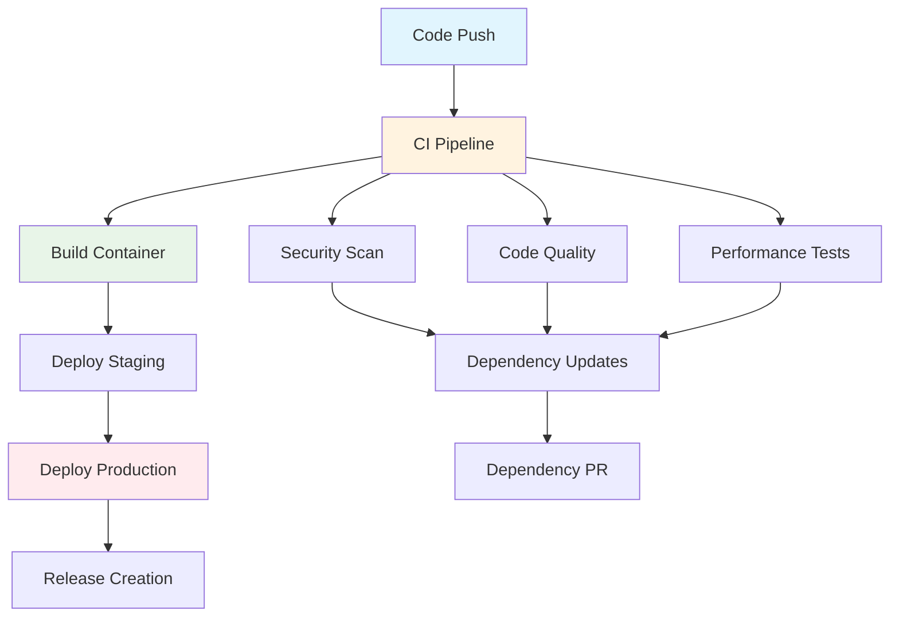

# GitHub Actions CI/CD Pipeline

This directory contains a comprehensive CI/CD pipeline for the Weather Data Engineering API project. The pipeline includes automated testing, security scanning, code quality analysis, dependency management, performance monitoring, and deployment workflows.

## 🚀 Workflow Overview

### Core CI Pipeline (`.github/workflows/ci.yml`)
**Triggers**: Push to main/develop, Pull requests
**Purpose**: Primary continuous integration pipeline

- **Lint and Format**: Code style and formatting checks
- **Test Matrix**: Cross-platform testing on Python 3.9-3.12
- **Security Scan**: Basic security vulnerability scanning
- **Performance Tests**: API response time benchmarks
- **Documentation Check**: API documentation validation
- **Docker Build**: Container image build verification
- **Dependency Check**: Dependency vulnerability scanning

### Security Workflows (`.github/workflows/security.yml`)
**Triggers**: Weekly schedule, Push to main, PR with security-related changes
**Purpose**: Comprehensive security analysis

- **CodeQL Analysis**: Static analysis security testing
- **Trivy Scan**: Container and filesystem vulnerability scanning
- **Dependency Review**: Security review of dependency changes
- **Secret Scanning**: Detection of exposed secrets
- **Supply Chain Security**: SBOM generation and analysis
- **Compliance Check**: License compliance and security best practices

### Code Quality (`.github/workflows/code-quality.yml`)
**Triggers**: Push to main/develop, Pull requests, Weekly schedule
**Purpose**: Maintain code quality standards

- **Code Analysis**: Flake8, mypy, pylint analysis
- **Complexity Metrics**: Cyclomatic complexity and maintainability index
- **Dead Code Detection**: Unused code identification
- **Documentation Quality**: Docstring coverage and API documentation
- **Dependency Analysis**: Dependency tree and license analysis
- **Test Coverage**: Comprehensive coverage analysis

### Performance Monitoring (`.github/workflows/performance.yml`)
**Triggers**: Push to main, Pull requests, Weekly schedule
**Purpose**: Monitor and benchmark API performance

- **API Performance**: Load testing with Locust
- **Database Performance**: Query performance under load
- **Resource Monitoring**: Memory and CPU usage analysis
- **Threshold Enforcement**: Performance regression detection
- **Benchmark Reporting**: Automated performance reports

### Dependency Management (`.github/workflows/dependency-update.yml`)
**Triggers**: Weekly schedule, Manual trigger
**Purpose**: Automated dependency maintenance

- **Dependency Updates**: Automated package updates
- **Security Testing**: Safety checks on updated dependencies
- **Pull Request Creation**: Automated update PRs
- **Outdated Package Reporting**: Issue creation for outdated packages

### Deployment (`.github/workflows/deploy.yml`)
**Triggers**: Push to main, Version tags, Manual deployment
**Purpose**: Automated deployment to staging and production

- **Container Build**: Multi-platform Docker image creation
- **Staging Deployment**: Automated staging environment deployment
- **Production Deployment**: Controlled production releases
- **Smoke Testing**: Post-deployment validation
- **Release Management**: GitHub release creation

## 📋 Workflow Dependencies



## 🛠️ Configuration

### Environment Variables
- `DATABASE_URL`: Database connection string
- `DJANGO_SETTINGS_MODULE`: Django settings module
- `TESTING`: Flag for test environment
- `REGISTRY`: Container registry (ghcr.io)

### Secrets Required
- `GITHUB_TOKEN`: Automatically provided by GitHub
- Additional secrets may be needed for external services

### Quality Gates

#### CI Pipeline
- ✅ All linting checks pass
- ✅ Test coverage > 80%
- ✅ No security vulnerabilities (high/critical)
- ✅ Docker build succeeds
- ✅ Performance benchmarks met

#### Security Pipeline
- ✅ CodeQL analysis passes
- ✅ No secrets exposed
- ✅ Dependency vulnerabilities < moderate
- ✅ Container security scan passes

#### Code Quality
- ✅ Flake8 issues < 50
- ✅ High complexity functions < 5
- ✅ Maintainability index > 20
- ✅ Docstring coverage > 70%

#### Performance
- ✅ API response time < 2s
- ✅ Load test failure rate < 5%
- ✅ Memory usage < 80%
- ✅ CPU usage < 90%

## 🔧 Local Development

### Running Tests Locally
```bash
# Run all tests
python run_tests.py

# Run specific test modules
python run_tests.py --module health
python run_tests.py --module performance

# Run with coverage
python run_tests.py --coverage
```

### Code Quality Checks
```bash
# Linting
ruff check .
black --check .
isort --check-only .

# Type checking
mypy src/

# Security scanning
bandit -r src/
safety check
```

### Performance Testing
```bash
# Run performance tests
python run_tests.py --performance

# Load testing (requires running API server)
locust -f locustfile.py --host http://localhost:8000
```

## 📊 Monitoring and Reporting

### Artifacts Generated
- **Test Results**: HTML and XML test reports
- **Coverage Reports**: HTML coverage reports and badges
- **Security Reports**: Vulnerability scan results
- **Performance Reports**: Load testing results
- **Code Quality**: Complexity and maintainability metrics
- **Dependency Reports**: SBOM and license information

### Notifications
- **Pull Request Comments**: Automated quality and performance feedback
- **GitHub Issues**: Automated dependency and security notifications
- **Release Notes**: Automated release documentation

## 🚀 Deployment Environments

### Staging Environment
- **URL**: `https://weather-api-staging.example.com`
- **Trigger**: Push to main branch
- **Database**: PostgreSQL (test data)
- **Purpose**: Pre-production testing

### Production Environment
- **URL**: `https://weather-api.example.com`
- **Trigger**: Version tags (v*)
- **Database**: PostgreSQL (production data)
- **Purpose**: Live API service

## 🔍 Troubleshooting

### Common Issues

#### Test Failures
- Check database connectivity
- Verify environment variables
- Review test data setup

#### Security Scan Failures
- Update vulnerable dependencies
- Remove hardcoded secrets
- Fix security best practice violations

#### Performance Issues
- Check database query optimization
- Monitor memory and CPU usage
- Review API response times

#### Deployment Failures
- Verify container image builds
- Check environment configurations
- Review deployment logs

### Getting Help
- Check workflow logs in GitHub Actions
- Review generated artifacts
- Consult the project documentation
- Contact the development team

## 📈 Metrics and Analytics

### Key Performance Indicators
- **Test Coverage**: Target > 80%
- **Security Vulnerabilities**: Target = 0 high/critical
- **API Response Time**: Target < 2 seconds
- **Deployment Success Rate**: Target > 95%
- **Code Quality Score**: Target > 8/10

### Monitoring Dashboard
The CI/CD pipeline provides comprehensive monitoring through:
- GitHub Actions dashboard
- Security advisories
- Performance benchmarks
- Code quality reports
- Dependency health checks

## 🔄 Continuous Improvement

### Regular Maintenance
- Weekly dependency updates
- Monthly security reviews
- Quarterly performance analysis
- Annual workflow optimization

### Enhancement Opportunities
- Add more performance metrics
- Implement canary deployments
- Enhance security scanning
- Improve test coverage
- Add integration with external tools

---

*This CI/CD pipeline is designed to maintain high code quality, security, and performance standards while enabling rapid and reliable deployments of the Weather Data Engineering API.*
